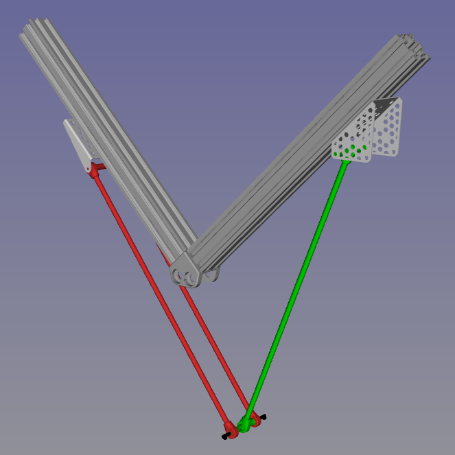

# 2Delta robot

## setting up the environment
### installing the pinocchio library
Follow the tutorial at the link [here](https://stack-of-tasks.github.io/pinocchio/download.html)
### installing gepetto viewer
If you are using Ubuntu 20.04 run:
~~~
sudo apt install robotpkg-py38-pinocchio robotpkg-py38-example-robot-data robotpkg-urdfdom robotpkg-py38-qt5-gepetto-viewer-corba robotpkg-py38-quadprog robotpkg-py38-tsid
~~~

If you are using Ubuntu 22.04 run:
~~~
sudo apt install robotpkg-py310-pinocchio robotpkg-py310-example-robot-data robotpkg-urdfdom robotpkg-py310-qt5-gepetto-viewer-corba robotpkg-py310-quadprog robotpkg-py310-tsid
~~~

## project
### inverse geomety of a closed chain robot
Since the URDF file and the ik algorithm can only solve for open chain systems, we are going to break down the problem, solving the ik for each pair of links, and let them converge to the same desired position.

### script
#### IK_solver class
The script implements a IK_solver class (see IK.solver.py). The class has two instances, one for each link chain. The **solve_GN** method uses the Gauss-Newton method in order to calculate the inverse geometry of the robot.
+ input:   (current joint position, desired end-effector position)
+ output:(new joint position)

#### path planning
Still to be done

### gepetto viewer

